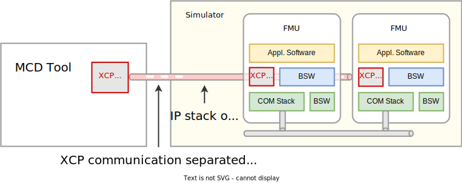
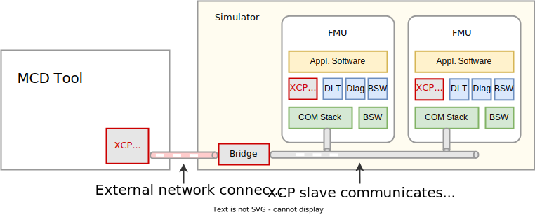
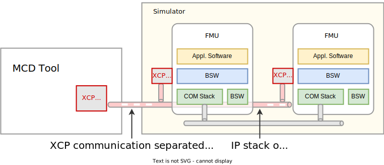

= FMI Layered Standard for XCP (fmi-ls-xcp)
:sectnums:
:sectnumlevels: 5
:toc: left
:toc-title: Contents
:toclevels: 5
:xrefstyle: short
:docinfo: shared
:stylesheet: fmi-spec.css
:stem: latexmath
:source-highlighter: highlightjs
:nofooter:
:favicon: images/favicon.ico
:revdate: unreleased
:revnumber: 1.0.0-rc.4
:icons: font

Based on FMI 2.0 and FMI 3.0, this layered standard defines how to describe and implement XCP support for FMUs, which can either provide an XCP service or allow direct memory access via A2L files.

_[Note: Although the document refers to versions 2.0 and 3.0 of the FMI standard, everything described in this document also applies to all subsequent minor versions._
_For further information on compatibility, see section https://fmi-standard.org/docs/3.0/#VersioningLayered[Versioning and Layered Standards] in the FMI 3.0 specification.]_

{empty} +
{empty}

Copyright (C) 2023-2024 The Modelica Association Project FMI.

This document is licensed under the Attribution-ShareAlike 4.0 International license.
The code is released under the 2-Clause BSD License.
The licenses text can be found in the https://raw.githubusercontent.com/modelica/fmi-ls-xcp/main/LICENSE.txt[LICENSE.txt] file that accompanies this distribution.

{empty}

== Introduction

=== Intent of This Document

FMI 3.0 was extended also with virtual Electronic Control Units (virtual ECUs) in mind.
Engineers can measure into ECUs using the XCP protocol and A2L variable descriptions:

[quote, ASAM e.V., https://www.asam.net/standards/detail/mcd-1-xcp]
____
The ASAM MCD-1 XCP (Universal Measurement and Calibration Protocol) standard defines a bus-independent, master-slave communication protocol to connect ECUs with calibration systems.
XCP is short for Universal Measurement and Calibration Protocol.
The primary purpose of XCP is to adjust internal parameters and acquire the current values of internal variables of an ECU.
The first letter X in XCP expresses the fact that the protocol is designed for a variety of bus systems.
The standard consists of a base standard, which describes memory-oriented protocol services without direct dependencies on specific bus systems.
Several associate standards contain the transport layer definitions for CAN, FlexRay, Ethernet (UDP/IP and TCP/IP), serial links (SPI and SCI) and USB.
____

This layered standard describes how an FMU advertises its XCP capabilities to importers and MCD (**M**easurement - **C**alibration - **D**iagnostics) tools using the XCP protocol.

=== How to Read This Document

This document is about how to describe and implement XCP support for FMUs, either by an FMU with integrated XCP service or how to use an external XCP service to access data inside the FMU.
To keep the descriptions brief and redundancy low, <<common-concepts,common concepts>>, which are used by both implementation types, are described once.

The standard document is in HTML allowing use of in-document links.
By pressing "t", the table of contents can be displayed on the left side or hidden.

In key parts of this document, non-normative examples are used to help understand the standard.

Conventions used in this document:

* Non-normative text is given in square brackets in italic font: _[Especially examples are defined in this style.]_

* The key words "MUST", "MUST NOT", "REQUIRED", "SHALL", "SHALL NOT", "SHOULD", "SHOULD NOT", "RECOMMENDED", "MAY", and "OPTIONAL" in this document are to be interpreted as described in https://tools.ietf.org/html/rfc2119[RFC 2119] (regardless of formatting and capitalization).

=== Outline of the Approach

There are alternative implementations depending on the use case and data availability:

 . The FMU implements one or more XCP slaves which provide access to measurement and calibration variables of the virtual ECU and handles the communication protocol with the XCP master in the MCD tool.
   The necessary information for an MCD tool is given in one or more variable description files which follow the https://www.asam.net/standards/detail/mcd-2-mc/[ASAM MCD-2 MC] standard (aka A2L, also <<ASAP2>>) and customarily carry the file extension `.a2l`.
   For further details see <<FMU with Integrated XCP Service>>.
 . An external XCP slave implementation accesses the memory of the virtual ECU to expose the XCP protocol to the MCD tool.
   In this case, the importer needs to provide such an XCP slave implementation using the A2L variable description file(s) provided by the FMU.
   `fmi3IntermediateUpdateCallback` calls or the clocks mechanism could be used to synchronize DAQ lists.
   For further details see <<External XCP Service>>.

It is also possible for an FMU to have integrated XCP service(s) and allow memory access for an external XCP service.

The importer might also use the A2L address, type, layout and scaling information to use direct memory access into the virtual ECU.
As this approach does not use the standardized XCP protocol it is not further described in this layered standard.

This layered standard will have no effect on the FMU interface, nor the C-API behavior.
If an XCP slave is implemented inside the FMU, it is recommended that it runs in its own thread and leaves the rest of the operation of the FMU unaffected.

The A2L/XCP standards allow to measure and calibrate variables synchronously to different types of events.
These so called event channels are either time-based, angular-based, or non-deterministic, and are identified by a unique event channel number (aka measurement raster).
The XCP service must be invoked with the defined event channel number in the thread which is executed for an event.
Calibration and communication with the XCP master is typically performed in a background thread.
The background thread must always be responsive to the XCP master within the defined communication timeout.
Refer to the A2L/XCP standards for more information.

The XCP/A2L approach can not only be used for virtual ECUs, but also for plant models, if the FMU exporter generates appropriate A2L files.

[#common-concepts]
== Layered Standard Manifest File

This layered standard defines additional elements that carry relevant interface definitions and capability flags in the layered standard manifest file.
<<table-schema-fmi-ls-xcp-attributes>> shows the attributes of the root element of `fmi-ls-manifest.xml`.

.Root Element Attribute Details.
[[table-schema-fmi-ls-xcp-attributes]]
[cols="1,1,1,2",options="header"]
|====
|Attribute
|Namespace
|Value
|Description

|`fmi-ls-name`
| `\http://fmi-standard.org/fmi-ls-manifest`
| `org.fmi-standard.fmi-ls-xcp`
| Name of the layered standard in reverse domain name notation.

|`fmi-ls-version`
| `\http://fmi-standard.org/fmi-ls-manifest`
| `1.0.0-rc.4`
| Version of the layered standard. This layered standard uses semantic versioning, as defined in <<PW13>>.

|`fmi-ls-description`
| `\http://fmi-standard.org/fmi-ls-manifest`
| `Layered standard based on FMI 2.0 and FMI 3.0 for describing and implementing XCP support for FMUs, which can either provide an XCP service or allow direct memory access via A2L files.`
| String with a brief description of the layered standard that is suitable for display to users.

|====

The root element must contain at least one, and can contain more than one `Interface` elements.
Each such element specifies one set of interface information for calibration using one underlying variable description file (A2L).
Multiple elements might be provided if there are different XCP slaves embedded in the FMU, or there are other reasons why multiple A2L variable description files that apply in parallel have to be provided.

Each `Interface` element has the <<following attributes,table-schema-fmi-ls-xcp-interface-attributes>>:

.Interface Element Attribute Details.
[[table-schema-fmi-ls-xcp-interface-attributes]]
[cols="1,1,1,2",options="header"]
|====
|Attribute
|Namespace
|Value
|Description

|`definition`
|
| Relative URI
| This attribute must be a relative reference to a URI (formerly called a relative URI) to the A2L variable description file for this interface.
It may not contain any dot-segments (i.e. complete path segments of `.` or `..`).
It is resolved to an absolute URI using a base URI that depends on the relevant FMU target, as defined in <<Structure of the FMU Archive>>.

|`types`
|
| List of `CoSimulation`, `ModelExchange`, `ScheduledExecution`
| Optional attribute to restrict the applicability of the interface being defined to certain FMU interface types.
The value is provided as a list of interface type names to which this interface applies.
If the attribute is not provided, the interface applies to all available FMU interface types.

|`description`
|
| String
| Optional human-readable description of the interface being defined.

|`containsXCPService`
|
| `true` or `false`
| If `true`, the FMU provides its own XCP slave implementation.
See <<FMU with Integrated XCP Service>>.
Defaults to `false`.

|`supportsDirectMemoryAccess`
|
| `true` or `false`
| If `true`, the FMU allows direct memory access from the outside via the information provided in its variable description file.
In most cases this mechanism will be used by an external XCP service provided by the importer.
See <<External XCP Service>>.
Defaults to `false`.

|====

The attribute `definition` is required, all other attributes of `Interface` are optional.
The FMU must provide a valid `definition` attribute and must set at least one of the attributes `containsXCPService` or `supportsDirectMemoryAccess` to `true` to comply with this layered standard.

Additionally the `Interface` element can contain one or more `Variable` elements, which assign relevant roles to existing FMU variables.

Each `Variable` element has the <<following attributes,table-schema-fmi-ls-xcp-variable-attributes>>:

.Variable Element Attribute Details.
[[table-schema-fmi-ls-xcp-variable-attributes]]
[cols="1,1,1,2",options="header"]
|====
|Attribute
|Namespace
|Value
|Description

|`name`
|
| Valid variable name
| Name of a variable defined in the `modelDescription.xml` of the FMU.

|`role`
|
| Valid role enum value
| Role of the variable. Must be a valid role as defined in <<configure-internal-xcp-service-settings>>.

|====

Each `Variable` entry assigns a role to an existing variable.
No variable shall occur in more than one `Variable` entry.
No role shall occur in more than one `Variable` entry of one `Interface`, but can occur again in `Variable` entries of a different `Interface`.
The set of allowed roles and their meaning is defined <<configure-internal-xcp-service-settings>>.

An example of a manifest file for this layered standard is shown below:

[source, xml]
----
include::examples/fmi_ls_xcp_manifest_example.xml[]
----

== Common Concepts

Independent of the selected implementation approach (see <<Outline of the Approach>>), the XCP behavior as seen by an external MCD tool (XCP master) shall be the same.
The concepts defined in this chapter are common to both of the implementation approaches.
The definitions that are specific to the particular implementation types are defined in <<FMU with Integrated XCP Service>> and <<External XCP Service>>.

=== Structure of the FMU Archive

The manifest file, any A2L variable description files and other files needed for XCP support are placed in `/extra/org.fmi-standard.fmi-ls-xcp`.
_[This allows these files to be added and modified after the FMU has been created without affecting any checksums.]_
The directory structure is analogous to the `binaries` directory structure, specific to the FMI version.
The structure for an FMI 3.0 FMU is shown below.
Details are described in the following sections.

[#figure-fmi-layered-XCP-directory-structure]
----
documentation
   fmi-ls-xcp.{txt|html}           // Informal description how to use XCP/A2L for this FMU (optional).
extra/org.fmi-standard.fmi-ls-xcp  // Contains files related to XCP/A2L
   fmi-ls-manifest.xml             // The layered standard manifest file
   <definition1.a2l>               // Variable description of a source code FMU (optional)
   <definition2.a2l>               // Variable description of a source code FMU (optional)
   ...
   x86_64-windows
      <definition1.a2l>            // Variable description for Windows on Intel 64-bit (optional)
      <definition2.a2l>            // Variable description for Windows on Intel 64-bit (optional)
      ...
   x86-linux
      <definition1.a2l>            // Variable description for Linux on Intel 32-bit (optional)
      ...
   aarch32-linux
      <definition1.a2l>            // Variable description for Linux on ARM 32-bit (optional)
      ...
   x86_64-darwin
      <definition1.a2l>            // Variable description for macOS (optional)
      ...
----

The `<definition1.a2l>` and `<definition2.a2l>` above are the relative URI references of the corresponding `definition` attributes of `Interface` elements.
The resultant absolute URI to the variable description file results from resolving the relative URI against the following base URI:
* For a source code FMU target the base URI is the URI of the manifest file.
* For a binary FMU target the base URI is the URI that results by replacing the file name part of the URI of the manifest file with a directory path component with the given target name of the relevant FMI version.

If multiple `Interface` elements are present in the manifest, then multiple A2L variable description files will be present at each level of the directory structure, as defined by their `definition` attribute values.

=== Documentation

When shipping an FMU with XCP/A2L support, it is recommended to provide the necessary information to the importer in the file `documentation/fmi-ls-xcp.{txt|html}`.
For example, this might concern additional information on how to build the final A2L file, if the FMU is delivered as source code.

=== A2L Description Files

[quote, ASAM e.V., https://www.asam.net/standards/detail/mcd-2-mc]
____
ASAM MCD-2 MC (aka ASAP2) defines the description format of the internal ECU variables used in measurement and calibration.
Measurement & calibration systems (MC-systems) require this description for both the parameterization of scalar constants, curves and maps of the ECU software and for recording the system's response via measurement variables during real-time testing.
The description contains information about data types, dimensions, record layouts and memory locations of ECU variables.
The standard also describes how the variable values are converted into human-readable quantities and displayed in an MC-system.
____

The A2L description depends on the FMU binary, for example, regarding memory addresses, and byte order.
If an FMU archive contains multiple binaries for different platforms, the associated A2L files are placed into separate subdirectories below `/extra/org.fmi-standard.fmi-ls-xcp` following the same scheme as in the `binaries` directory, see <<Structure of the FMU Archive>>.
It is highly advisable that all A2L files in the FMU use the same XCP configuration, i.e., the same protocol (TCP/UDP), the same ports, and so on.

Note that the A2L files placed under the `extra` directory are not accessible to the FMU at runtime.
Any files that shall be accessible to the FMU at runtime must (also) be placed into the `resources` directory as defined by the FMI standard.

A2L files may have a considerable size.
If size is a concern, it may be decided to supply just a single platform and A2L file with an FMU.

The root name of the A2L file shall be identical to the `identifier` attribute from the `Interface` element of the manifest file and is case sensitive.

All format versions of the A2L standard are allowed and it is the responsibility of the MCD tool to handle each format version correctly.

This layered standard forbids the use of the `including mechanism` of additional A2L files to simplify complete extraction and copying of the A2L file to a location where it is accessible by the MCD tool.

The handling of address information in the A2L file depends on the selected implementation approach for the XCP slave (FMU-internal or external, see <<Outline of the Approach>>) and on the FMU format (binary or source code FMU).
See <<address-resolution-internal>> and <<address-resolution-external>>, respectively, for detailed information about address resolution.

=== XCP Protocol Settings

The A2L description shall include `IF_DATA XCP` elements to help MCD tools to connect and interact with the XCP service of the FMU more reliably and without user interaction.
Parts of the `IF_DATA XCP` description depend on the machine where the FMU binary is executed, for example, the IP address and port.

The default IP address assigned by the FMU exporter should be `localhost`, i.e., `127.0.0.1`, which fits in many cases.
The requirement for the port number is, that it must be unique on the machine where the FMU binary is executed.
Typically, a certain range of ports is reserved for this purpose.
The FMU importer is responsible for checking if any conflicts of the defined IP addresses and port numbers occur in the context of the simulated system.

In the case of an internal XCP service, it is sometimes necessary for the FMU importer to override the default IP address and/or port number which was assigned by the FMU exporter.
For more information about how to configure and handle the XCP service, see <<configure-internal-xcp-service-settings>>.
In the case of an external XCP service the connection settings are under the control of the importer.

=== Source Code FMUs

An FMU may be delivered as source code together with a `buildDescription.xml` file.
This case requires a common understanding of the A2L workflow between the FMU exporter and importer.
In practice there are different flavors of the workflow depending on the specific use case.

The FMU exporter shall describe the measurement variables (`MEASUREMENT`), calibration parameters (`CHARACTERISTIC`) and related A2L elements of its application in the A2L file.
The A2L file is necessarily incomplete as the details of the A2L description depend on the binary for the target platform.
For example, the real addresses and memory segments are not known until the FMU binary is built.
For information on how to deal with memory addresses refer to <<address-resolution-internal>> or <<address-resolution-external>>, respectively.

The A2L description is placed directly into the folder `/extra/org.fmi-standard.fmi-ls-xcp` if it is target-independent, or in target-specific subfolders otherwise (see <<Structure of the FMU Archive>>).

The FMU importer is responsible for ensuring that the target-specific information in the A2L file is adapted to the target platform for which a source code FMU is built, before making the A2L file available to the MCD tool.

If additional information for the build process and A2L creation is required, it should be provided by the FMU exporter in `/documentation/fmi-ls-xcp.{txt|html}`.

=== Variable Visibility

The `modelDescription.xml` file publishes a certain set of variables and parameters.
The A2L file also publishes a set of FMU variables and parameters.
This standard expressly does not restrict the relationship between both sets of variables.

_[As a matter of fact, it is quite likely that the variables published in `modelDescription.xml` is a minimal set required for connectivity reasons._
_The A2L file might publish a much larger set of variables and parameters that the user can selectively choose to measure or calibrate._

_From the viewpoint of an MCD tool, the details of the variable access are transparent, i.e., this information is encapsulated in the A2L file.]_

=== Numeric Effects of XCP Access

While measurement of FMU internal variables does not have a numeric effect on the FMU, so called calibration does.
Calibration is the tuning of FMU internal parameters.
Such changes will affect the numeric behavior of the FMU.
If the FMU contains controller code, numeric stability or energy preservation laws are of lesser concern.
On the other hand, plant models offering XCP access for parameter calibration may introduce surprising numerical effects in solvers that might require proper handling, like resetting solvers with every XCP write action.

It is therefore necessary to synchronize XCP variable access (read and write) with the state of the FMU.
_[For instance is time not linear in Model Exchange and Intermediate Variable Access might also introduce surprising measurements in Co-Simulation._
_Appropriate care must be taken when to serve XCP master requests to ensure simulation and measurement integrity.]_

== FMU with Integrated XCP Service

If the XCP slave is implemented in the FMU, the FMU is responsible for handling the communication protocol with the XCP master.
The following sections describe how to configure and handle the internal XCP slave.

The FMU states that it contains an internal XCP slave implementation with the `containsXCPService` attribute in the `fmi-ls-manifest.xml` file.

_[<<XCP-Communication-via-IP-Stack>> shows a typical design where the XCP slave (in the FMU) communicates with the XCP master (in the MCD tool) using a separate network channel, e.g., the IP stack of the host OS._
_Thus, the communication of the XCP service is not mixed with the simulated network communication of the ECU wrapped in the FMU._
footnote:[The network communication of FMUs is described by another layered standard.
The details of network communication are out of scope here.]

_<<XCP-Communication-via-Virtual-ECU-COM-Stack>> shows an alternative design where the XCP slave communicates via the COM stack of the virtual ECU as in a real ECU._
_In this case, the simulator has to provide access to the simulated network communication for the MCD tool._
_This design may be chosen if the XCP slave implementation is already part of a level-3 ECU code to be tested._
footnote:[The same design could be used to access a diagnostic service, if it is implemented by the ECU code inside the FMU.]

.Direct communication of XCP master and XCP slave via the IP stack of the host OS.
[#XCP-Communication-via-IP-Stack]

.Communication of XCP master and XCP slave via the COM stack of the virtual ECU.
[#XCP-Communication-via-Virtual-ECU-COM-Stack]

_The implementation of the XCP slave inside the FMU shall only use calls of the host OS, which leave the behavior of the FMU unaffected._
_This concerns, for example, host OS calls_
footnote:[The term 'host OS' means the OS where the FMU process is executed.
This could even be the OS inside a virtual machine connected to the simulator.]
_needed for creation of an own background thread._
_Note that blocking OS calls should be avoided, because they may have an effect on other parts of the simulator outside the FMU.]_

[#configure-internal-xcp-service-settings]
=== Configuring the XCP Protocol Settings

To avoid collisions in a simulation system with several XCP services, it can be necessary for the FMU importer to override the default port number the FMU listens on, which was assigned by the FMU exporter in the XCP slave implementation and in the A2L file (see <<XCP Protocol Settings>>).

Besides the listen port number, the user may also want to change or restrict the listen IP address, which is the IP address of the network interface to which the socket of the XCP service is bound and where it is listening for XCP client commands.
In most cases, the listen IP address will be set to `INADDR_ANY`, i.e., `0.0.0.0`, allowing connections from any available network interface.
However, it is possible to restrict the XCP service to, e.g., only allow local connections by setting the listen IP address to `127.0.0.1`.

Furthermore, it is likely valuable for the user to have the possibility to deactivate the internal XCP service to avoid certain problems with the environment, e.g., with anti-virus software or firewalls or when running the FMU in a container.
The importer might also want to use an external XCP service even when an internal XCP service is available.

Therefore, if the XCP slave is embedded in the virtual ECU, the FMU should expose the following configuration capabilities as variables in the `modelDescription.xml` file, which are used to configure the embedded XCP slave (see <<starting-internal-xcp-service>>).
The variable that is provided for a capability is identified by providing a `Variable` element in the relevant `Interface` element of the manifest file, with the name of the variable and its role as the corresponding attribute values.

Enable XCP over TCP:: Determines whether the TCP instance of the XCP service provided by the FMU shall be started.
+
[cols="1h,4"]
|===
|Role                 |`XCPServiceTCPEnable`
|Type                 |`Boolean` 
|Example Start Value  |`true`
|Requirement Type     |Should be supplied, if the FMU provides an XCP service using TCP.
|If not present       |Defaults to `true`, i.e. if the XCP slave supports TCP it will be started.
|===

TCP listen port number:: TCP port number where the XCP slave listens for XCP protocol commands.
+
[cols="1h,4"]
|===
|Role                 |`XCPServiceTCPPort`
|Type                 |`UInt16` / `Integer` 
|Example Start Value  |In an agreed range of ports, e.g., `32768` to `39999`.
|Requirement Type     |Should be supplied, if the FMU provides an XCP service using TCP.
|If not present       |Defaults to the protocol data values found in the relevant A2L file.
|===

TCP listen IP address:: IP address where the XCP slave listens for XCP protocol commands over TCP.
+
[cols="1h,4"]
|===
|Role                 |`XCPServiceTCPListenAddress`
|Type                 |`String` 
|Example Start Value  |`0.0.0.0`.
|Requirement Type     |Should be supplied, if the FMU provides an XCP service using TCP.
|If not present       |Defaults to the protocol data values found in the relevant A2L file.
|===

Enable XCP over UDP:: Determines whether the UDP instance of the XCP service provided by the FMU shall be started.
+
[cols="1h,4"]
|===
|Role                 |`XCPServiceUDPEnable`
|Type                 |`Boolean` 
|Example Start Value  |`false`
|Requirement Type     |Should be supplied, if the FMU provides an XCP service using UDP.
|If not present       |Defaults to `true`, i.e. if the XCP slave supports UDP it will be started.
|===

UDP listen port number:: UDP port number where the XCP slave listens for XCP protocol commands.
+
[cols="1h,4"]
|===
|Role                 |`XCPServiceUDPPort`
|Type                 |`UInt16` / `Integer` 
|Example Start Value  |In an agreed range of ports, e.g., `32768` to `39999`.
|Requirement Type     |Should be supplied, if the FMU provides an XCP service using UDP.
|If not present       |Defaults to the protocol data values found in the relevant A2L file.
|===

UDP listen IP address:: IP address where the XCP slave listens for XCP protocol commands over UDP.
+
[cols="1h,4"]
|===
|Capability Attribute |`XCPServiceUDPListenAddress`
|Type                 |`String` 
|Example Start Value  |`0.0.0.0`.
|Requirement Type     |Should be supplied, if the FMU provides an XCP service using UDP.
|If not present       |Defaults to the protocol data values found in the relevant A2L file.
|===

All variables that are defined must be defined as scalars with one of the following `causality`/`variability` combinations:

* **fixed structuralParameter (FMI 3.0 only):**
If the FMU defines the variables as `structuralParameters`, the XCP configuration can be changed during `Configuration Mode`.
When the XCP service is started in `fmi3ExitConfigurationMode`, it is configured and running before the simulation starts, i.e., before `Initialization Mode` is entered.
For FMI 3.0, this is the most flexible variant and should be preferred over the other variants.

* **fixed parameter:**
If the FMU defines the variables as `parameters`, the FMU signals that it does not support `Configuration Mode`.
For FMI 3.0, this means, the XCP service is started at the latest when `Initialization Mode` is entered.
In case of FMI 2.0, the FMU should preferably start the XCP service in the `fmi2SetupExperiment` function.
This allows for configuring the XCP service with the configuration parameters and ensuring that the service is running before the simulation starts.
This is the preferred variant for FMI 2.0.

* **constant output:**
If the FMU is restricted to a fixed XCP configuration, it shall at least announce its configuration to the outside.
This could be done via `constant outputs` that can be used in another model.
It allows the importer to read the configuration and, e.g., react to port collisions without having to read the A2L file.
With this variant the importer will not be able to deactivate the XCP service or to change the port number, which can lead to collisions when several FMUs are imported.

* **fixed/tunable calculatedParameter:**
This variant is similar to **constant output**.
The FMU does not allow its XCP configuration to be changed directly, but it announces its configuration via `calculatedParameters` that depend on other `parameters`.
With this variant the importer has no direct influence on activating or deactivating the XCP service or changing the port number, which can lead to collisions when several FMUs are imported.

_[The variables above do not necessarily have to share the same `causality`/`variability` combination._
_However, e.g., a mixture of `structuralParameters` and `parameters` is not sensible._
_If `Configuration Mode` is supported, then `structuralParameters` should be used._
_On the other hand, an FMU could have parts of its XCP configuration fixed while leaving others configurable._
_In this case, a combination of, e.g., `structuralParameters` and `constant outputs` could make sense.]_

The configuration variables are duplicated for both transport layers, TCP and UDP, as it is technically possible to have an XCP slave that uses TCP and UDP channels in parallel.
The FMU shall only provide the corresponding variables for the protocols it supports.

Without knowing the concrete XCP slave implementation the importer cannot know if the different protocols can be used in parallel or only exclusively.
In case the XCP service is not multi-session capable and both of the variables with role `XCPServiceTCPEnable` and `XCPServiceUDPEnable` are set to `true`, the FMU must return an error and provide a meaningful error message when exiting `Configuration Mode`.
This information may also be provided in the `documentation` directory inside the FMU.

The importer of an FMU is responsible for keeping all occurrences of the port number consistent, i.e., in both the FMU configuration and in the A2L file.

[#starting-internal-xcp-service]
=== Starting and Stopping the XCP Service

Since an XCP slave is implemented inside the FMU, the FMU is responsible for starting and stopping the internal XCP service.

*Using FMI 3.0*, the FMU should preferably expose its XCP configuration variables (see <<figure-xcp-configuration-parameters>>) as `structuralParameters` and start the XCP service during the first invocation of `fmi3ExitConfigurationMode` and shut it down during `fmi3Terminate`, if the FMU has no explicit power-up signal to simplify user interactions between simulator and MCD tool.
If the FMU contains a virtual ECU with power-up control (K15), all built-in OS and Basic Software services (including XCP) should follow the normal power-up protocol.

If the simulator puts the FMU in `Configuration Mode` and sets the structural parameters with role `XCPService[TCP|UDP]ListenAddress` and `XCPService[TCP|UDP]Port`, the XCP slave shall use those parameters to set up the communication connection for the XCP protocol.

If the value of structural parameter with role `XCPService[TCP|UDP]Enable` is `true`, the XCP slave must be responsive for XCP commands on the corresponding channel (TCP/UDP) after leaving `Configuration Mode`.
Thus, it is possible for the XCP master to perform calibration during the `Instantiated` state, for example, to set parameters before entering `Initialization Mode`.
Note that reading values of calculated variables, which depend on an initialization function, is only possible after entering the `Initialized` super state with `fmi3ExitInitializationMode`.

If the variable with role `XCPService[TCP|UDP]Enable` is `false`, the internal XCP service must not be started with TCP/UDP, the network resources must not be used and no XCP service actions must be performed by the FMU on this channel during simulation.
If both parameters are `false` the XCP service must not be started at all.

If `Configuration Mode` was not entered and the value of variable with role `XCPService[TCP|UDP]Enable` is `true`, the FMU must start the XCP service in `fmi3EnterInitializationMode` at the latest.
In this case, it is not possible to perform calibration before `Initialization Mode` is entered or to configure the XCP connection settings.

If the importer re-enters `Configuration Mode` and reconfigures the parameters it is up to the FMU if it reacts to the parameter change or not.

*Using FMI 2.0*, the FMU should preferably expose its XCP configuration variables as `parameters` and start the XCP service during the first call of `fmi2SetupExperiment` and shut it down during `fmi2Terminate` if the FMU has no explicit power-up signal to simplify user interactions between simulator and MCD tool.
The importer is responsible for calling `fmi2SetupExperiment` at least once and setting the parameters before `fmi2SetupExperiment` is called.

If the FMU does not expose its XCP configuration variables as `structuralParameters` using FMI 3.0, or as `parameters` using FMI 2.0, the importer will not have control over whether the internal XCP service should be started.
In this case, the default value of the `start` attribute of the variable with role `XCPService[TCP|UDP]Enable`, if it exists, determines if the XCP service is started.
If no variable of this role exists, then the XCP service is always started.

_[Note that it is not possible to manually change the `start` value for any variable in the `modelDescription.xml` file to change the behavior of the internal XCP service._
_The `start` value merely reflects the default behavior coded into the FMU.]_

[#address-resolution-internal]
=== Memory Address Resolution

Dependent on the FMU format and the XCP slave implementation inside the FMU, dealing with memory addresses of variables in the A2L file differs.

If the FMU is in binary format, i.e., it is shipped with a shared library, the FMU exporter must provide values for the ECU addresses inside the A2L file and the XCP slave inside the FMU is responsible for resolving the physical addresses from the address field values.
_[These address field values can be either real addresses or fixed target-independent indices that are used by the XCP slave implementation for getting variables during runtime.]_

If the FMU is only shipped with source code, it is not possible to determine the memory addresses before building the binary, i.e., real addresses cannot be provided by the exporter in the A2L file.
In this case the address field values in the A2L file must be either fixed target-independent indices, which allow the FMU to resolve the addresses at runtime, or the A2L file only contains linker symbol links (`SYMBOL_LINK`).
In the latter case, the importer or an external A2L tool is responsible for determining the actual variable addresses from the symbol links.
These addresses must be relative to the base address of the built FMU binary.
Refer to the https://www.asam.net/standards/detail/mcd-2-mc/[ASAM MCD-2 MC] standard for more information on symbol links and automatic address update.

If the FMU exporter does not use real (offset) addresses in the A2L file in the binary FMU case, or does not provide symbol links in the source code FMU case, attribute `supportsDirectMemoryAccess` in the `fmi-ls-manifest.xml` file must be set to `false` (see <<address-resolution-external>>).

== External XCP Service

An FMU might support XCP but does not bring along its own XCP slave implementation (attribute `containsXCPService = false` in the corresponding `Interface` element of the `fmi-ls-manifest.xml` file).
In this case the FMU importer must provide its own implementation of an XCP slave.

It is also possible that the FMU does contain an internal XCP slave implementation but additionally allows the importer to access the memory of the virtual ECU with an external XCP service (attribute `supportsDirectMemoryAccess = true`).
In this case it is the choice of the importer whether to use the FMU internal XCP slave or its own implementation.
See <<starting-internal-xcp-service>> on how to deactivate the internal XCP service.

Although the XCP behavior for an internal and an external service is the same from the perspective of the MCD tool (XCP master), the operation of the external XCP service differs from the internal one in some points that are described in this chapter.

_[<<XCP-Communication-external-Slave>> shows a design where the XCP slave is implemented by the importer outside of the FMU._
_In this variant the XCP communication uses the IP stack of the host OS analogous to the design in <<XCP-Communication-via-IP-Stack>>.]_

.Communication of XCP master and external XCP slave via the IP stack of the host OS.
[#XCP-Communication-external-Slave]

[#configure-external-xcp-service-settings]
=== Configuring the XCP Protocol Settings

For an external XCP service no structural parameters for the XCP configuration are needed, because the importer has the entire control over the XCP service and is responsible for its configuration.
_[The importer should allow the user to set IP address and port number analogous to the variant with an internal XCP service.]_

When an external XCP service is used, the importer has to make XCP service calls and is responsible for creating events for its XCP service.
However, in contrast to the FMU with internal XCP support, the importer does not have the knowledge about the inner structure of the virtual ECU and therefore it is not able to create specific XCP events, e.g., one event for each task.

This means, by default, the importer can only make XCP calls at certain points in time, e.g., at communication points in Co-Simulation, ignoring specific task-related XCP events.
The importer is responsible for matching the `IF_DATA XCP` section in the A2L file to the implementation of the XCP service.
If necessary, the `IF_DATA XCP` section must be added or replaced in the A2L file delivered with the FMU, before making it available to the MCD tool.
For example, the importer can create an event channel for a basic measurement raster and write the corresponding event definition into the `IF_DATA XCP` section of the A2L file.

If a Co-Simulation FMU announces that it makes use of the intermediate update callback function (attribute `providesIntermediateUpdate = true` of the Co-Simulation element), the importer may also create another event for the intermediate update raster and call the XCP service in each `fmi3IntermediateUpdateCallback` with the event channel number of this event.

Furthermore, if the FMU contains clocks, the importer might also provide the user with the ability to create separate XCP events for each clock.
In this case the simulator is responsible for handling the mapping between clock and XCP event and must call the XCP service with the corresponding event channel when the associated clock is active just before leaving `Event Mode`.

[#starting-external-xcp-service]
=== Starting and Stopping the XCP Service

Since the XCP slave is implemented outside the FMU, the importer is responsible for starting and stopping the external XCP service.
_[Preferably, the start-up is performed sometime during the `Instantiated` state of the FMU to allow the XCP master to set parameters before entering `Initialization Mode`.]_

[#address-resolution-external]
=== Memory Address Resolution

Depending on the FMU format, dealing with memory addresses of variables in the A2L file differs.

In the binary FMU case, the A2L file must contain real addresses, which are relative to the base address of the FMU binary, allowing the external XCP slave to access the memory of the FMU correctly.

Since the external XCP slave can only make use of real addresses and in the case of source code FMUs there are no real addresses available yet, the A2l file must contain linker symbol links (`SYMBOL_LINK`).
In this case, analogous to the use of an internal XCP slave, the importer or an external A2L tool is responsible for determining the actual variable addresses from the symbol links.

== Known Limitations of This Standard

General limitations:

* This standard forbids the use of the `including mechanism` of additional A2L files to simplify complete extraction and copying of the A2L file to a location where it is accessible by the MCD tool.

* If the FMU contains target-specific binaries _and_ target-specific source code for the same platform, the corresponding A2L files cannot be assigned uniquely.
Therefore, this constellation is not applicable to this layered standard and the FMU exporter must decide between source code and binary files for this platform.

Limitations for binary FMUs:

* Normally only variables in the memory segments owned by the main FMU binary `<modelIdendifier>.{dll|so}` are accessible by the XCP service, i.e., variables defined in source code modules and in statically linked libraries.
Accessing variables in the memory of indirectly loaded dynamic libraries requires a special implementation which is out-of-scope for this layered standard.

== Contributions

- Christian Bertsch, Robert Bosch GmbH, Germany
- Matthias Blesken, dSPACE GmbH, Germany
- Cl&#225;udio Gomes, Aarhus University, Denmark
- Andreas Junghanns, Synopsys, Germany
- Ulrich Kiffmeier, dSPACE GmbH, Germany
- Pierre R. Mai, PMSF IT Consulting, Germany
- Benedikt Menne, dSPACE GmbH, Germany
- Torsten Sommer, Dassault Syst&#232;mes, Germany
- Markus S&#252;vern, dSPACE GmbH, Germany
- Patrick T&#228;uber, dSPACE GmbH, Germany

Contributions to this layered standard to the FMI standard are covered by the https://github.com/modelica/fmi-standard.org/blob/main/static/assets/FMI_CCLA_v1.0_2016_06_21.pdf[Corporate Contributors License Agreement (CCLA)] of the Modelica Association Project FMI.

[bibliography]
== References

- [[[PW13]]] Preston-Werner, T. (2013): **Semantic Versioning 2.0.0**.  https://semver.org/spec/v2.0.0.html
- [[[ASAP2]]] ASAM MCD-2 MC. https://www.asam.net/standards/detail/mcd-2-mc/
- [[[RFC2119]]] RFC 2119. https://tools.ietf.org/html/rfc2119
